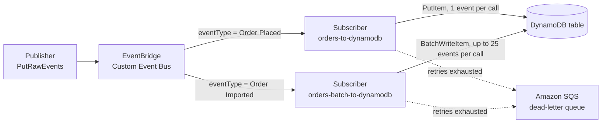

# Amazon EventBridge Custom Event Bus to Amazon DynamoDB

This pattern creates an Amazon EventBridge Custom Event Bus with two subscribers that write events to an Amazon DynamoDB table, with no AWS Lambda function in the path. Both subscribers use a *universal target* to call a DynamoDB API action directly, building the request from the event with a JSONata expression: one calls `PutItem` for each event, the other groups events and calls `BatchWriteItem` with up to 25 events per call.

Learn more about this pattern at Serverless Land Patterns: https://serverlessland.com/patterns/eventbridge-custom-bus-dynamodb

Important: this application uses various AWS services and there are costs associated with these services after the Free Tier usage - please see the [AWS Pricing page](https://aws.amazon.com/pricing/) for details. You are responsible for any AWS costs incurred. No warranty is implied in this example.

## Requirements

* [Create an AWS account](https://portal.aws.amazon.com/gp/aws/developer/registration/index.html) if you do not already have one and log in. The AWS IAM user that you use must have sufficient permissions to make necessary AWS service calls and manage AWS resources.
* [AWS CLI](https://docs.aws.amazon.com/cli/latest/userguide/install-cliv2.html) installed and configured. The EventBridge Custom Event Bus uses the `eventsv2` API, so AWS CLI v2.37.3 or later is required (earlier versions name the command `aws eventbridgev2` or do not include it). Check your version with `aws --version`.
* [Git Installed](https://git-scm.com/book/en/v2/Getting-Started-Installing-Git)
* [AWS Serverless Application Model](https://docs.aws.amazon.com/serverless-application-model/latest/developerguide/serverless-sam-cli-install.html) (AWS SAM) installed

## Deployment Instructions

1. Create a new directory, navigate to that directory in a terminal and clone the GitHub repository:
    ```
    git clone https://github.com/aws-samples/serverless-patterns
    ```
1. Change directory to the pattern directory:
    ```
    cd serverless-patterns/eventbridge-custom-bus-dynamodb/sam
    ```
1. From the command line, use AWS SAM to deploy the AWS resources for the pattern as specified in the `template.yaml` file:
    ```
    sam deploy --guided
    ```
1. During the prompts:
    * Enter a stack name
    * Enter the desired AWS Region
    * Allow SAM CLI to create IAM roles with the required permissions.

    Once you have run `sam deploy --guided` mode once and saved arguments to a configuration file (samconfig.toml), you can use `sam deploy` in future to use these defaults.

1. Note the outputs from the SAM deployment process. These contain the resource names and/or ARNs which are used for testing.

## How it works

The template deploys an EventBridge Custom Event Bus, a DynamoDB table, an Amazon SQS dead-letter queue, and two subscribers. Events are published with `PutRawEvents`, which sends the JSON payload as is and lets the publisher attach metadata. Each subscriber filters events on the `eventType` metadata key and delivers them to a *universal target*, a DynamoDB API action that EventBridge calls directly. A JSONata expression in the subscriber builds the API request from the event, so no Lambda function is needed.

* **Single write** (`orders-to-dynamodb`): events with `eventType` `Order Placed` are written one at a time with `PutItem`.
* **Batch write** (`orders-batch-to-dynamodb`): events with `eventType` `Order Imported` are collected for up to 10 seconds or 25 events (the `BatchWriteItem` limit) and written with a single `BatchWriteItem` call.

With the batch write, a failure affects the whole batch: if two events in a batch have the same `id`, or if DynamoDB throttles the call, EventBridge retries the entire batch and, once the retries are exhausted, writes one record to the dead-letter queue listing the IDs of all events in the batch. Configure the dead-letter queue for the batch subscriber; without it, failed batches are dropped and the only trace is the `EventsDropped` metric. Failed events stay on the bus for the retention period and can be replayed to a new subscriber.

`BatchWriteItem` can also succeed partially: DynamoDB returns HTTP 200 and lists the writes it did not process, for example because of throttling, in `UnprocessedItems`. The [universal target documentation](https://docs.aws.amazon.com/eventbridge/latest/userguide/eb-custom-bus-universal-targets.html) does not describe any handling of `UnprocessedItems`, so assume that EventBridge treats such a call as delivered: the unprocessed items are neither retried nor written to the dead-letter queue. Use the batch subscriber where an occasional lost write is acceptable or can be detected and replayed from the bus. Where every write must be accounted for, use the single-write subscriber, whose `PutItem` call either succeeds or fails as a whole, or put a Lambda function in the path that retries `UnprocessedItems`.

## Architecture



1. A publisher sends events to the Custom Event Bus with `PutRawEvents` and sets the `eventType` metadata key.
2. Each subscriber filters on `eventType` and calls its DynamoDB universal target directly, assuming the delivery role. There is no Lambda function in the path.
3. Both subscribers write to the same DynamoDB table.
4. Deliveries that still fail after the retry policy is exhausted are recorded on the shared dead-letter queue. The delivery role, not a queue policy, grants `sqs:SendMessage` on the queue.

## Testing

1. Set the name of the stack you deployed, then read the bus ARN and table name from the stack outputs:

    ```bash
    STACK_NAME=your-stack-name

    EVENT_BUS_ARN=$(aws cloudformation describe-stacks \
      --stack-name "$STACK_NAME" \
      --query "Stacks[0].Outputs[?OutputKey=='EventBusArn'].OutputValue" --output text)

    TABLE_NAME=$(aws cloudformation describe-stacks \
      --stack-name "$STACK_NAME" \
      --query "Stacks[0].Outputs[?OutputKey=='TableName'].OutputValue" --output text)
    ```

2. Test the single write. Publish the `Order Placed` event in `events/event.json`, then read the item after a few seconds:

    ```bash
    aws eventsv2 put-raw-events \
      --event-bus-arn "$EVENT_BUS_ARN" \
      --entries file://events/event.json \
      --cli-binary-format raw-in-base64-out

    aws dynamodb get-item \
      --table-name "$TABLE_NAME" \
      --key '{"id":{"S":"1001"}}'
    ```

    Each entry in the event file holds the JSON payload in `Data`, the `eventType` in `Metadata`, and the content type `application/json`. `--cli-binary-format raw-in-base64-out` lets the AWS CLI send `Data` as written instead of expecting Base64. The response from `put-raw-events` confirms only that the bus accepted the event. The `get-item` call should return an item with `id` `1001` and an `eventType` of `Order Placed`.

3. Test the batch write. Publish the three `Order Imported` events in `events/batch-events.json`. The subscriber waits up to 10 seconds for more events before it writes the batch, so read the items after about 15 seconds:

    ```bash
    aws eventsv2 put-raw-events \
      --event-bus-arn "$EVENT_BUS_ARN" \
      --entries file://events/batch-events.json \
      --cli-binary-format raw-in-base64-out

    aws dynamodb batch-get-item --request-items "{
      \"$TABLE_NAME\": { \"Keys\": [
        {\"id\":{\"S\":\"2001\"}}, {\"id\":{\"S\":\"2002\"}}, {\"id\":{\"S\":\"2003\"}}
      ] }
    }"
    ```

    You should see three items with an `eventType` of `Order Imported`.

4. If an item does not appear, check the dead-letter queue. Each record names the error code and the IDs of the failed events:

    ```bash
    DLQ_URL=$(aws cloudformation describe-stacks \
      --stack-name "$STACK_NAME" \
      --query "Stacks[0].Outputs[?OutputKey=='DeadLetterQueueUrl'].OutputValue" --output text)

    aws sqs receive-message --queue-url "$DLQ_URL"
    ```

    To see a failed batch, publish `events/batch-events.json` twice within 10 seconds. The second copy lands in the same batch as the first, DynamoDB rejects the batch because of the duplicate IDs, and a `CUSTOMER_VALIDATION` record appears on the queue after the retries.


## Cleanup

1. From the pattern directory, delete the stack. AWS SAM reads the stack name and Region from the `samconfig.toml` file written by `sam deploy --guided`:
    ```bash
    sam delete
    ```

----
Copyright 2025 Amazon.com, Inc. or its affiliates. All Rights Reserved.

SPDX-License-Identifier: MIT-0
